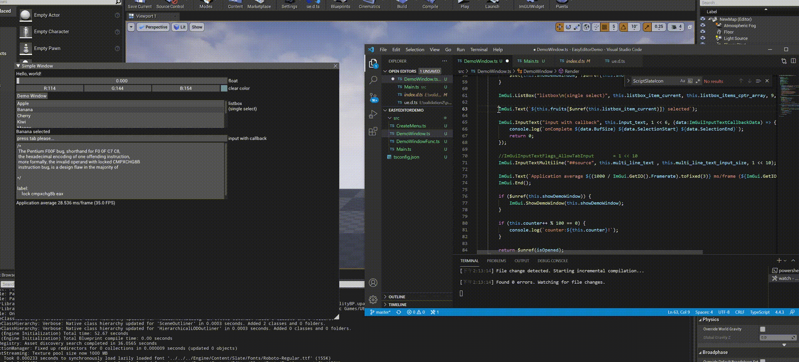

# EasyEditorPlugin

## EasyEditorPlugin是什么

EasyEditorPlugin是一个UE下快速开发编辑器扩展的插件，其特点：

* 1、几行代码即可添加主菜单、工具栏按钮、上下文菜单、Detail扩展等等；

* 2、运行时脚本热刷新；

* 3、代码即是UI，结合2可实现UI热刷新；

* 4、nodejs + npm海量扩展可用

* 5、脚本可调用任意UE API，可调用几乎所有c++库

## 效果图

## demo工程

[EasyEditorPluginDemo](https://github.com/puerts/EasyEditorPluginDemo)

## 代码示例

### 添加主菜单

~~~typescript
const main_menu = menus.FindMenu("LevelEditor.MainMenu");
const script_menu = main_menu.AddSubMenuScript(main_menu.GetName(), "Puerts", "Puerts", "Puerts", "Puerts Demo...");

const entry = UE.ToolMenuEntry.InitMenuEntry("ShowDemoWindow", "ShowDemoWindow", "just a test...", () => {
    let demo = new DemoWindow();
    cpp.UEImGui.AddGlobalWindow(demo.Render.bind(demo));
})
script_menu.AddMenuEntry("Scripts", entry);
~~~

### 添加工具栏按钮

~~~typescript
const toolbar = menus.FindMenu('LevelEditor.LevelEditorToolBar')
const entry = UE.ToolMenuEntry.InitToolBarButton("Widget", "ImGUIWidget", () => {
    cpp.UEImGui.AddGlobalWindow(() => {
        //console.log('toolbar button click')
    });
});
toolbar.AddMenuEntry("ImGUIWidget", entry);
~~~

### 添加工具栏下拉按钮(ComboButton)

~~~typescript
const icon = new cpp.FSlateIcon("EditorStyle", "LevelEditor.WorldProperties", "LevelEditor.WorldProperties.Small");
const entry = UE.ToolMenuEntry.InitComboButton("Puerts", undefined, (tool_menu: UE.ToolMenu) => {
    const sub_entry = UE.ToolMenuEntry.InitMenuEntry("ShowDemoWindow", "ShowDemoWindow", "just a test...", () => {
        //console.log('toolbar combo button click')
    });
    tool_menu.AddMenuEntry("ShowDemo", sub_entry);
}, "Puerts", "Puerts", icon);
toolbar.AddMenuEntry("ComboButton", entry);
~~~

### 添加文件夹右键菜单

~~~typescript
const folder_context_menu = menus.FindMenu('ContentBrowser.FolderContextMenu');
const entry = UE.ToolMenuEntry.InitMenuEntry("PuertsOpen", "PuertsOpen", "just a test...", (context: UE.ToolMenuContext) => {
    if (context) {
        const context_menu_context =  UE.ToolMenus.FindContext(context, UE.ContentBrowserDataMenuContext_FolderMenu.StaticClass()) as UE.ContentBrowserDataMenuContext_FolderMenu;
        if (context_menu_context) {
            const selected_items = context_menu_context.SelectedItems;
            console.log(`selected_items num:${selected_items.Num()}`);
            for(var i = 0; i < selected_items.Num(); i++) {
                const selecte_item = selected_items.Get(i);
                let path = $ref<string>();
                selecte_item.GetItemPhysicalPath(path);
                console.log(`name:${selecte_item.GetItemName()}, path:${path}, isfolder:${selecte_item.IsFolder()}`);
            }
        } 
    }
});
folder_context_menu.AddMenuEntry("TS", entry);
~~~

### 添加asset右键菜单

~~~typescript
const asset_context_menu = menus.FindMenu('ContentBrowser.AssetContextMenu');
const entry = UE.ToolMenuEntry.InitMenuEntry("PuertsAssetOpen", "PuertsAssetOpen", "just a test...", (context: UE.ToolMenuContext) => {
    if (context) {
        const context_menu_context =  UE.ToolMenus.FindContext(context, UE.ContentBrowserAssetContextMenuContext.StaticClass()) as UE.ContentBrowserAssetContextMenuContext;
        console.log(typeof context_menu_context);
        if (context_menu_context) {
            const selected_objects = context_menu_context.SelectedObjects;
            console.log(`selected_objects num:${selected_objects.Num()}`);
            for(var i = 0; i < selected_objects.Num(); i++) {
                const selecte_objects = selected_objects.Get(i);
                console.log(typeof(selecte_objects), selecte_objects.GetClass().GetName());
            }
        }
    }
});
asset_context_menu.AddMenuEntry("TS", entry);
~~~

### 添加命令行

~~~typescript
cpp.EasyEditorPlugin.AddConsoleCommand("Puerts.TestCmd", "just a test...", (...args:string[]) => {
    for(var i = 0; i < args.length; i++) {
        console.log(`arg${i}: ${args[i]}`);
    }
})

~~~

## ImGui相关

本部分内容需要添加两个插件：[UEImgui](https://github.com/ZhuRong-HomoStation/UEImgui)、[EasyEditor_ImGui](https://github.com/puerts/EasyEditor_ImGui)

如果需要接入其它UI能力，或者其它c++库提供的能力，可参考[该文档](Doc/extension.md)

### 添加Detail扩展
~~~typescript
cpp.UEImGui.AddDetailCustomization(UE.Actor.StaticClass(), (obj:UE.Object) => {
    cpp.UEImGui.BeginDetail();
    cpp.ImGui.Text(`Actor Name:${obj.GetName()}`);
    cpp.UEImGui.EndDetail();
});
~~~

### ImGUI窗口

~~~typescript
ImGui.SetNextWindowSize(new ImVec2(200, 100), 1 << 2)

ImGui.Begin(this.simple_window_titil, isOpened);
ImGui.Text("Hello, world!");
ImGui.Text(`Application average ${(1000 / ImGui.GetIO().Framerate).toFixed(3)} ms/frame (${ImGui.GetIO().Framerate.toFixed(1)} FPS)`);

ImGui.End();
~~~

## 依赖

* [Puerts](https://github.com/Tencent/puerts)
* [UEImgui](https://github.com/ZhuRong-HomoStation/UEImgui)
* [EasyEditor_ImGui](https://github.com/puerts/EasyEditor_ImGui)